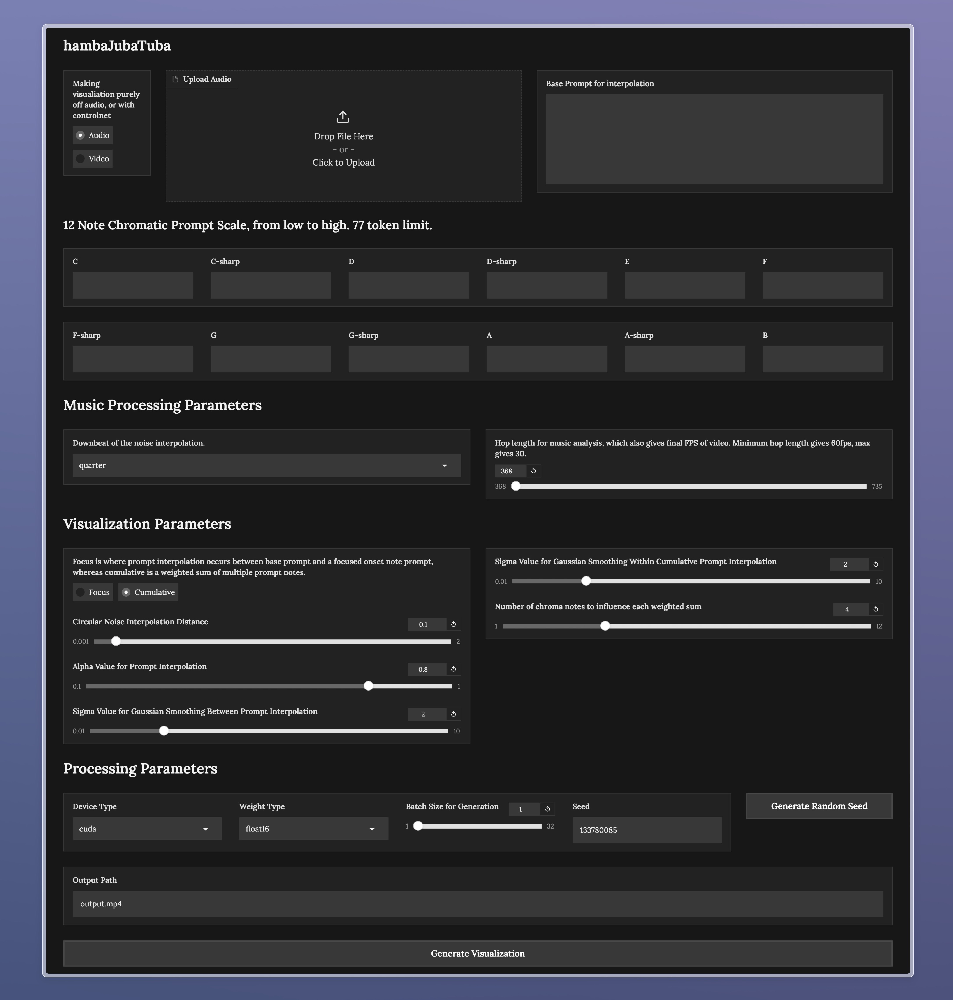

# hambaJubaTuba -- A Diffusion Based Music Visualizer! 

<p align="center">
  
</p>

## [Demo Video](https://youtu.be/hW7U9wsK3io)

## What is this?

In the aims of bringing back the music visualizer to modern day society, this project was made. Visualizations are made via:
- Latent vector interpolation, based on the bpm of the song and the power (volume) of the moment in the song.
    - Interpolation occurs in a spiraling circle movement for non repetetive scenes, along with cubic easing for satisfying visuals. 
- Prompt vector interpolation, based on a 12 note (prompts) chromatic scale.
  	- Prompt interpolations are done via detecting which notes bring on the onset of the next moments of the song (chorus, bridge, etc.) Then the interpolation strength is based on the power levels of the chromatic notes
  	- Based on the onset detected notes, prompt interpolation can either be done via
  	  	- **Focused** Slerp interpolation between base prompt and the strongest singular chromatic prompt
  	  	- **Cumulative** Weighted sum prompt between base prompt and the strongest onset chromatic prompts
- Controlnet can be used to create visualizations based on videos, such as tiktoks of people doing dance challenges.

Check my blogpost for more information, and a demo video.

## Performance 

As this was developed on my M1 Mac, I have kept the model using Hyper-SD1.5, using 1 step inference. An image takes about 0.7 seconds to be generated on my machine, and you can pick at what fps you want the visualization to be generated. 

## Usage

A gui is provided for ease of use. You can also directly use the main.py and mainCtrl.py modules for CLI use.

```
pip install -r requirements.txt
gradio gui.py

```

If you want to use a different model, you can do that easily by just editing the loadPipe functions in the source code. SDXL is already implemented in the code, with the according pooled prompt embeddings. I just found it too slow for my M1 Mac.

## License

This project is licensed under the Non-Commercial License - see the [LICENSE](LICENSE) file for details.

Stable diffusion model of this project is from [Original Repository](https://huggingface.co/ByteDance/Hyper-SD/blob/main/LICENSE.md) by [Original Author](https://huggingface.co/ByteDance)
